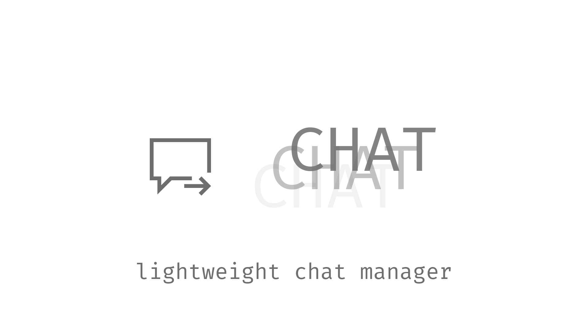

<h4 align="center"><a href="https://github.com/ProjectEssentials/ProjectEssentials-Chat/releases/download/v1.15.2-1.1.0/Project.Essentials.Chat-1.15.2-1.1.0.jar">Download mod</a> · <a href="https://mairwunnx.gitbook.io/project-essentials/project-essentials-chat#how-to-install">How to install</a> · <a href="https://mairwunnx.gitbook.io/project-essentials/project-essentials-chat#permissions">Permissions</a> · <a href="https://mairwunnx.gitbook.io/project-essentials/project-essentials-chat#configuration">Configuration</a> · <a href="https://github.com/ProjectEssentials/ProjectEssentials-Chat/issues/new/choose">Troubleshooting</a> · <a href="https://t.me/minecraftforge">News & updates</a> · <a href="changelog.md">Change log</a></h4>

<h4 align="center">lightweight chat manager for forge, with simple anti-spam and anti-advertising and anti-swearing protection, also with configuration.</h4>

#### Compatibility

Currently mod branch supported forge version `31.0.X` and `31.1.X` (Minecraft `1.15.2`).

#### Credits

- Author: Pavel Erokhin [@mairwunnx](https://github.com/mairwunnx)
- [JetBrains](https://www.jetbrains.com/) for Licenses
- And you for contributing or using it.
